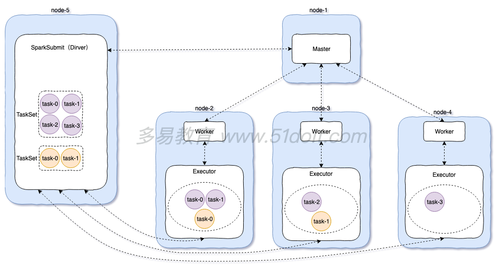

# 2.1 Spark Intro

## Spark简介

### 什么是Spark

Spark是一种快速、通用、可扩展的大数据分析引擎（框架），2009年诞生于加州大学伯克利分校AMPLab，2010年开源，2013年6月成为Apache孵化项目，2014年2月成为Apache的顶级项目。

.png>)

### Spark的特点

Spark的API是高度封装的，我们只需要写函数，把相应的处理逻辑传进去就可以了。

### Spark与MapReduce的对比

| **框架**    | **优点**       | **缺点**               |
| --------- | ------------ | -------------------- |
| MapReduce | 历史悠久、稳定      | 编程API不灵活、速度慢、只能做离线计算 |
| Spark     | 通用、编程API简洁、快 | 跟MapReduce比暂无缺点      |

## Spark架构体系

.png>)

### Spark中重要角色

* **Master** ：是一个Java进程，接收Worker的注册信息和心跳、移除异常超时的Worker、接收客户端提交的任务、负责资源调度、命令Worker启动Executor。
* **Worker** ：是一个Java进程，负责管理当前节点的资源关联，向Master注册并定期发送心跳。Worker自己不执行进程，负责启动Executor（Executor向SparkSubmit反向注册，真正进行计算执行任务），并监控Executor的状态。以后任务是运行在`CoarseGrainedExecutorBackend`的进程里。
* **SparkSubmit** ：是一个Java进程，负责向Master提交任务。
* **Driver ：**是很多类的统称，可以认为SparkContext就是Driver，client模式Driver运行在SparkSubmit进程中，cluster模式单独运行在一个进程中，负责将用户编写的代码转成Tasks，然后调度到Executor中执行，并监控Task的状态和执行进度。
* **Executor** ：是一个Java进程，负责执行Driver端生成的Task，将Task放入线程中运行。

### 分布式计算程序


### Spark和Yarn角色对比

| **Spark Standalone的Client模式** |      **YARN**     |
| :---------------------------: | :---------------: |
|             Master            |  ResourceManager  |
|             Worker            |    NodeManager    |
|            Executor           |     YarnChild     |
|      SparkSubmit（Driver）      | ApplicationMaster |

## Spark环境搭建

### 架构说明

**（standalone模式）**

standalone模式是Spark自带的分布式集群模式，不依赖其他的资源调度框架。



### 搭建步骤

* 下载Spark安装包，下载地址：[https://spark.apache.org/downloads.html](https://spark.apache.org/downloads.html)

.png>)

* 上传spark安装包到Linux服务器上
* 解压spark安装包：

`tar -zxvf spark-2.3.3-bin-hadoop2.7.tgz -C /bigdata/`

* 将conf目录下的`spark-env.sh.template`重命名为`spark-env.sh`，并修改：

`export JAVA_HOME=/opt/jdk1.8.0_251`

`export SPARK_MASTER_HOST=miao1`

* 将conf目录下的slaves.template重命名为slaves并修改，指定Worker的所在节点：

`miao2`

`miao3`

* 将配置好的Spark拷贝到其他节点：

`for i in {2..3}; do scp -r spark-2.3.3 node-$i.51doit.cn:$PWD; done`

### 启动Spark集群

* 在Spark的安装目录执行启动脚本
* 执行jps命令查看Java进程

在miao1上可用看见Master进程，在其他的节点上可用看见到Worker

* 访问Master的web管理界面，端口8080： [http://miao1:8080/](http://miao1:8080/)

 (1).png>)

## 启动Spark Shell编程

### 什么是Spark Shell

Spark Shell是Spark中的交互式命令行客户端，可以在Spark Shell中使用Scala编写Spark程序，启动后默认已经创建了SparkContext，别名为sc。

### 启动Spark Shell

`[root@miao1 spark-2.4.5-bin-hadoop2.7]# bin/spark-shell --master spark:// miao1:7077 --executor-memory 512m --total-executor-cores 3`

参数说明：

`--master` 指定master的地址和端口，协议为spark://，端口7077是RPC的通信端口。如果不指定会在local模式运行，没有把任务提交到集群，因为它找不到master是谁。

`--executor-memory` 指定每一个executor的使用的内存大小，每个机器默认用1G。

`--total-executor-cores` 指定整个application总共使用了cores，如果不指定会默认把集群所有的核都用了。

 (1).png>)

### 在shell中编写spark程序

`scala> sc.textFile("hdfs://miao1:9000/word.txt").flatMap(.split(" ")).map((,1)).reduceByKey(+).sortBy(_._2,false).collect`

`res5: Array[(String, Int)] = Array((hello,4), (tom,2), (jerry,2))`

或者是将结果写到HDFS：

`sc.textFile("hdfs://miao1:9000/word.txt").flatMap(.split(" ")).map((,1)).reduceByKey(+).sortBy(_._2,false).saveAsTextFile("hdfs://miao1:9000/out11")`

 (1).png>)

## 在IDEA中编写WordCount

1. 导入maven依赖&#x20;
2. 编写程序&#x20;
3. 打包&#x20;
4. 上传jar包到任意一个安装了Spark的节点上
5. 使用命令提交Spark

### 编写程序

1. 创建SparkContext
2. 创建RDD
3. 调用RDD的Transformation方法
4. 调用Action
5. 释放资源

```scala
object WordCount {
  def main(args: Array[String]): Unit = {

    //编写Spark程序 就是对抽象的神奇大集合【rdd】进行编程
    //调用它高度封装的API

    val conf: SparkConf = new SparkConf().setAppName("WordCount")

    //创建SparkContext，使用SparkContext来创建一个RDD
    val sc = new SparkContext(conf)

    val lines: RDD[String] = sc.textFile(args(0))

    ////////////Transformation开始////////////
    
    //切分压平
    val words: RDD[String] = lines.flatMap(_.split(" "))

    //将单词和1组合放在元组中
    val wordAndOne: RDD[(String, Int)] = words.map((_,1))

    //分组聚合，reduceByKey可以先局部聚合再全局聚合
    val reduced: RDD[(String, Int)] = wordAndOne.reduceByKey(_+_)

    //排序
    val sorted: RDD[(String, Int)] = reduced.sortBy(_._2,false)

    //调用Action将计算结果保存到HDFS中
    sorted.saveAsTextFile(args(1))

    //释放资源
    sc.stop()

  }
}
```

### 打包、提交、运行

写好之后打成jar包（maven里的`package`按键），上传到集群任意一台机器（in this case, _miao1_），然后进入到Spark的bin目录下，输入以下命令和参数：

`[root@miao1 bin]# ./spark-submit --master spark://miao1:7077 --executor-memory 1g --total-executor-cores 4 --class cn.cosette.spark.day01.WordCount /tmp/TestFiles/learnspark-1.0-SNAPSHOT.jar hdfs://miao1:9000/word.txt hdfs://miao1:9000/out2`

其中：（旧参数说明同上）

`--class`指定了jar包的执行的入口（也就是mian方法）

`/tmp/TestFiles/learnspark-1.0-SNAPSHOT.jar`指定了被执行jar包的路径

`hdfs://miao1:9000/word.txt`是args(0)，即程序里第一个参数：传入的文件

`hdfs://miao1:9000/out2`是args(1)，即程序里第二个参数：写运算结果传出的文件

## 注意

### 与Scala集合进行区分

* Scala集合的方法和RDD方法很多名字都是一样的，功能的用法也一样，但底层实现不一样。
* Scala集合是对一个JVM内存中数据进行处理，RDD是对分散在多台机器上的数据进行计算。

### Spark的RDD

Resilent Distributed DataSet：弹性、可复原的分布式数据集，这个数据集装的是数据的描述信息。

上文代码中的`sc.textFile("hdfs://miao1:9000/word.txt")`创建一个RDD。

Spark中RDD的方法（算子）分为2类：

1. Transformation：转换算子，将一个已经存在的RDD，转换成一个新的RDD，转换算子的特点是lazy的，延迟执行
2. Action：行动算子，主触发任务生成，然后提交到集群中运行

而在WordCount中，&#x20;

* Transformation有: `flatMap`、`map`、`reduceByKey`；
* Action有：`saveAsTextFile`、`collect`
