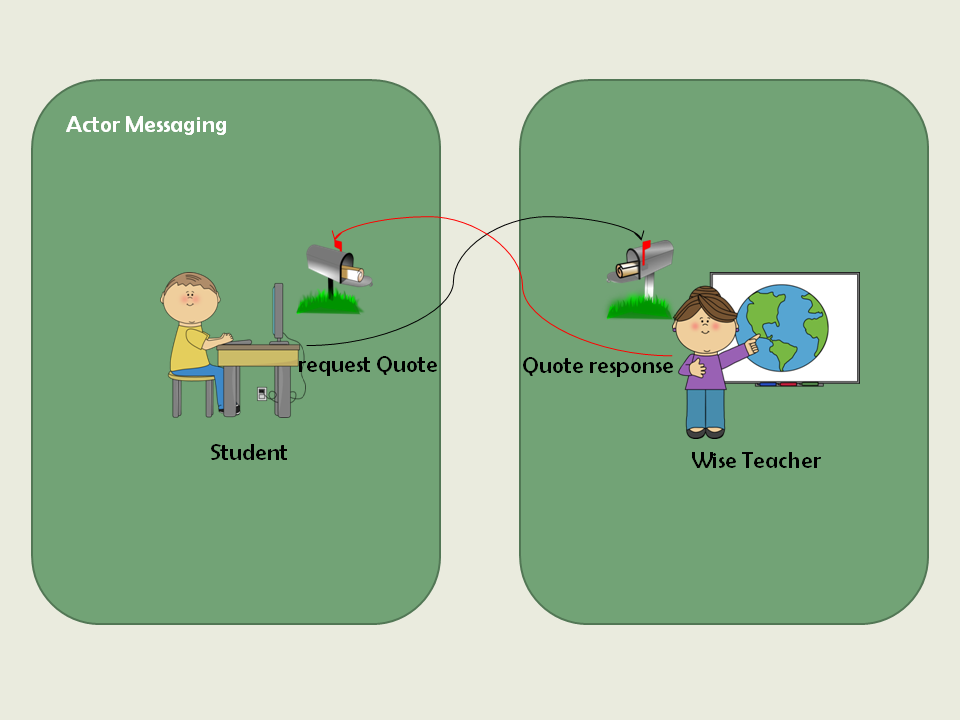
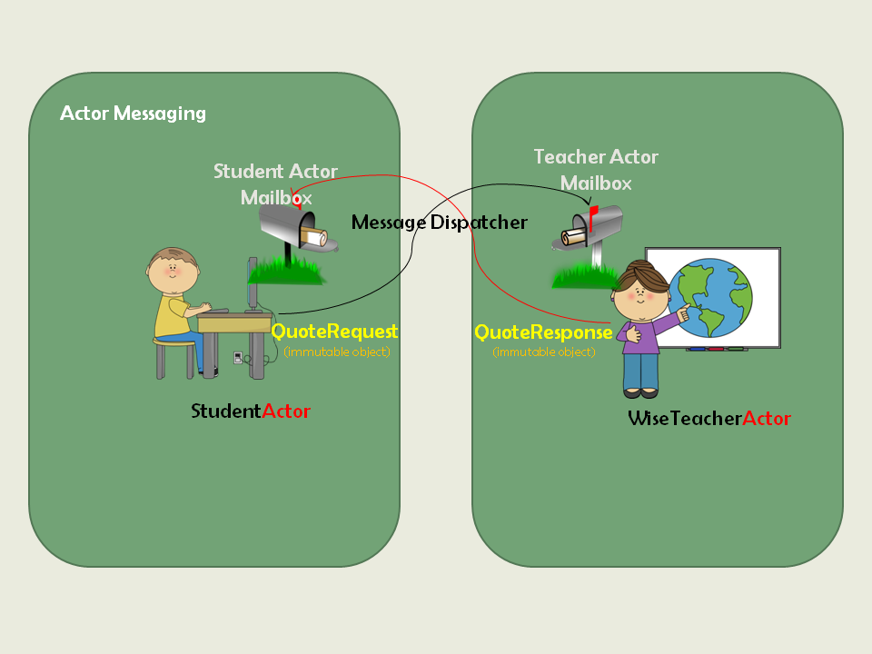

# 1.5 Actor & Akka

在JVM领域，比较流行的、高效的、通信框架有哪些？

* **Netty**: 使用Java编写，基于Java Nio、事件驱动的并发编程框架，可以实现多种网络编程协议（如Http、TCP、UDP）【Hadoop、Spark】
* **Akka**：用Scala编程的一个异步通信框架、基于Actor编程模型，通过发送消息实现并发，支持Scala和Java的API【Spark、Flink】
* **Mina**：用Java编程的NIO通信框架

## :bookmark: Akka

### 简介

Akka是JAVA虚拟机JVM平台上构建高并发、分布式和容错应用的工具包。Akka用Scala语言写成，同时提供了Scala和JAVA的开发接口。


Akka官网


### 特点

* Simple Concurrency & Distribution 单并发性&分布式
* Resilient by Design 可恢复的、弹性的
* High Performance 高效的
* Elastic & Decentralized 弹性、去中心的（分散）
* Extensible 可扩展

Akka处理并发的方法基于Actor模型。在Akka里，Actor之间通信的唯一机制就是消息传递。

## :bookmark: Actors

我们把Actors当作是一个人，这个人不会直接说话，他们只通过mail来进行交流【发送消息】。Actor是并发、多线程编程的模型。以下是Actor的特性：

### 一、消息传递

假设有两个人：学生和聪明的老师。学生每天早上都会给老师发送邮件【消息】，而聪明的老师都会回复一句名言。这里需要解释：

1. 学生发送邮件【消息】。一旦发送成功，邮件不能再修改【撤回】，天然就具备了不可变性
2. 老师会自己决定何时检查邮箱【定时器定期检查】
3. 老师还会回复一封邮件（也是不可变的）
4. 学生会自己决定何时检查邮箱【定时器定期检查】
5. 学生不会一直等待回信（非阻塞的）

是基于异步消息通知的。综上，就可以总结出Actor模型的一个基本特征——消息传递。



### 二、并发

现在，假设有三个聪明的老师和三个学生。每个学生都会给每个老师发送邮件。这会发生什么事？其实什么都没改变！每个人都有他自己的邮箱。这里需要注意的一点：**默认情况下，邮箱里面的邮件是按照他们先后达到的次序进行阅读和处理的。**\
本质上，这很像是ConcurrentLinkedQueue。没有人去等待邮件被阅读，简单来说这就是一个非阻塞的消息（在Akka中内置了许多的mailboxes，这里http://doc.akka.io/docs/akka/snapshot/scala/mailboxes.html，包括了有界和基于优先级的。其实，我们自己也可以去实现）。

.png>)

### 三、错误恢复

假如这三个老师分别来自不同的院系：历史系、地理系和哲学系。\
历史系的老师用过去的某个事件笔记进行回复；而地理系的老师回复了一个有趣的地点；哲学系的老师回复了一个引用。每个学生分别给每个老师发送消息并分别得到回复。学生并不关心邮件到底是系里的哪个老师回复的。如果有一天有个老师生病了呢？系里至少得有一个老师在处理邮件才行。这样的话，系里的另一位老师就会顶上这项工作。

.png>)

这里需要注意的地方：

1. 会有一个Actor池，每个Actor会处理不同的事件。
2. Actor做的事情可能会抛出异常，而它自己无法从中恢复。这种情况下，需要再生成（created ）一个新的Actor来顶替它。换句话说，这个新的Actor会忽略刚才那条消息，继续处理剩余的消息。这些也被称为指令（Directive）。

### 四、多任务

假设学生需要考试成绩，每个老师是通过邮件来发送的。也就是说，Actor可以处理多种类型的消息。

### 五、消息链

假如学生只想收到一封邮件而不是三件呢？\
我们也可用用Actor来实现！我们可以通过分层来把老师连在一起。在后面讲到Supervisor和Future的时候再回来讲。应Mohan的要求，我们把类比的实体和Actor模型中的组件做一下映射。



学生和老师变成我们的Actor，Email Inbox对应Mailbox 组件。请求和响应不可修改、它们是不可变对象。最后，Actor中的MessageDispatcher组件将管理mailbox，并且将消息路由到对应的Mailbox中。

### Actor总结

Actor类似一个人，是用来收发消息的，通过发送消息实现并发，一个Actor就是一个类的实例。

在上面的例子中，老师和学生都是Actor，发送的邮件是消息。可以创建多个Actor实现高并发，所有的Actor都需要管理者（教学总监、班主任）来创建和管理Actor。以后发送的消息是带类型的，可以根据消息类型进行匹配，来处理不同的逻辑。

如果用Scala实现，用到的知识点：case class、case object。

## :bookmark: Akka-Rpc项目搭建

Akka-Rpc is a different project from 'Learn-Scala'. This part's code is here:


Akka-Rpc Project Code


### 项目模块

1. 负责管理的角色：ActorSystem（总监）单例的，在Scala中就是一个object
2. 负责通信的：Actor，多实例的
3. 发送的消息：case class和case objce
4. 发消息的方式：异步、同步


### 项目依赖

创建一个Maven工程，引入maven依赖：Sscala依赖，Akka的依赖，打包依赖等。

```markup
<!-- 定义的一些常量 -->
<properties>
 <maven.compiler.source>1.8</maven.compiler.source>
 <maven.compiler.target>1.8</maven.compiler.target>
 <encoding>UTF-8</encoding>
 <scala.version>2.11.12</scala.version>
 <scala.compat.version>2.11</scala.compat.version>
 <akka.version>2.4.17</akka.version>
</properties>
<dependencies>
 <!-- scala的依赖 -->
 <dependency>
 <groupId>org.scala-lang</groupId>
 <artifactId>scala-library</artifactId>
 <version>${scala.version}</version>
 </dependency>
 <!-- akka actor依赖，如果只引入akka-actor，只能开发单进程的通信程序-->
 <dependency>
 <groupId>com.typesafe.akka</groupId>
 <artifactId>akka-actor_2.11</artifactId>
 <version>${akka.version}</version>
 </dependency>
 <!-- akka远程通信依赖 -->
 <dependency>
 <groupId>com.typesafe.akka</groupId>
 <artifactId>akka-remote_2.11</artifactId>
 <version>${akka.version}</version>
 </dependency>
</dependencies>
<build>
 <pluginManagement>
 <plugins>
 <!-- 编译scala的插件 -->
 <plugin>
 <groupId>net.alchim31.maven</groupId>
 <artifactId>scala-maven-plugin</artifactId>
 <version>3.2.2</version>
 </plugin>
 <!-- 编译java的插件 -->
 <plugin>
 <groupId>org.apache.maven.plugins</groupId>
 <artifactId>maven-compiler-plugin</artifactId>
 <version>3.5.1</version>
 </plugin>
 </plugins>
 </pluginManagement>
 <plugins>
 <plugin>
 <groupId>net.alchim31.maven</groupId>
 <artifactId>scala-maven-plugin</artifactId>
 <executions>
 <execution>
 <id>scala-compile-first</id>
 <phase>process-resources</phase>
 <goals>
 <goal>add-source</goal>
 <goal>compile</goal>
 </goals>
 </execution>
 <execution>
 <id>scala-test-compile</id>
 <phase>process-test-resources</phase>
 <goals>
 <goal>testCompile</goal>
 </goals>
 </execution>
 </executions>
 </plugin>
 <plugin>
 <groupId>org.apache.maven.plugins</groupId>
 <artifactId>maven-compiler-plugin</artifactId>
 <executions>
 <execution>
 <phase>compile</phase>
 <goals>
 <goal>compile</goal>
 </goals>
 </execution>
 </executions>
 </plugin>
 <!-- 打jar插件 -->
 <plugin>
 <groupId>org.apache.maven.plugins</groupId>
 <artifactId>maven-shade-plugin</artifactId>
 <version>2.4.3</version>
 <executions>
 <execution>
 <phase>package</phase>
 <goals>
 <goal>shade</goal>
 </goals>
 <configuration>
 <filters>
 <filter>
 <artifact>*:*</artifact>
 <excludes>
 <exclude>META-INF/*.SF</exclude>
 <exclude>META-INF/*.DSA</exclude>
 <exclude>META-INF/*.RSA</exclude>
 </excludes>
 </filter>
 </filters>
 <transformers>
 <transformer implementation="org.apache.maven.plugins.shade.resource.AppendingTransformer">
 <resource>reference.conf</resource>
 </transformer>
 <!-- 指定maven方法 -->
 <!-- <transformer implementation="org.apache.maven.plugins.shade.resource.ManifestResourceTransformer">-->
 <!-- <mainClass>cn._51doit.rpc.Master</mainClass>-->
 <!-- </transformer>-->
 </transformers>
 </configuration>
 </execution>
 </executions>
 </plugin>
 </plugins>
</build>
```

1. 引入maven编译scala的插件、打包插件
2. 分别在main、test目录下建立scala目录，变成源码包

### 打包与运行

在项目Master、Worker等程序、逻辑都写好后，利用**shade**进行打包。打包的时候可以在pom文件里指定main方法，分别把Worker和Master两个进程都打成两个jar包，复制到桌面改对应的名字：

```markup
<!-- 指定main方法 -->
<transformer implementation="org.apache.maven.plugins.shade.resource.ManifestResourceTransformer">
<mainClass>cosette.akka.rpc.Worker</mainClass>
</transformer>
```

再在cmd命令行执行语句、传入参数启动进程：

```bash
Master进程窗口：
java -jar master-akka-rpc-1.0-SNAPSHOT.jar localhost 8888

Worker进程窗口：
java -jar worker-akka-rpc-1.0-SNAPSHOT.jar localhost 9999 localhost 8888 4096 8 
```

也可以不指定main方法，pom文件里部分注释掉，直接打包，在运行的时候再指定main方法名称（在工程内类名右键 -> Copy Reference）。_记得`-cp`加到环境变量CLASSPATH里。_

```bash
java -cp master-akka-rpc-1.0-SNAPSHOT.jar cosette.akka.rpc.Master localhost 8888
```
