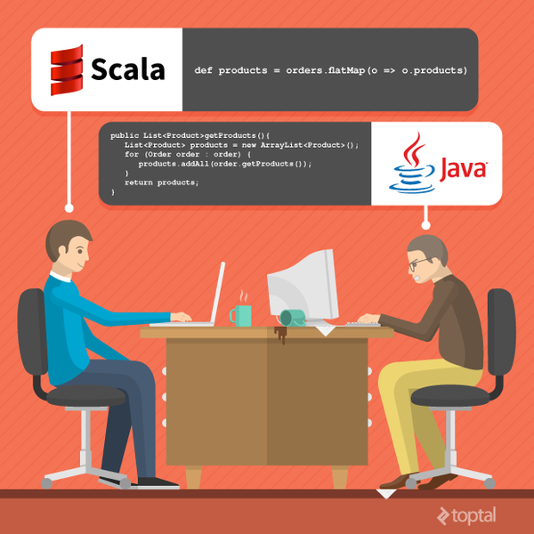
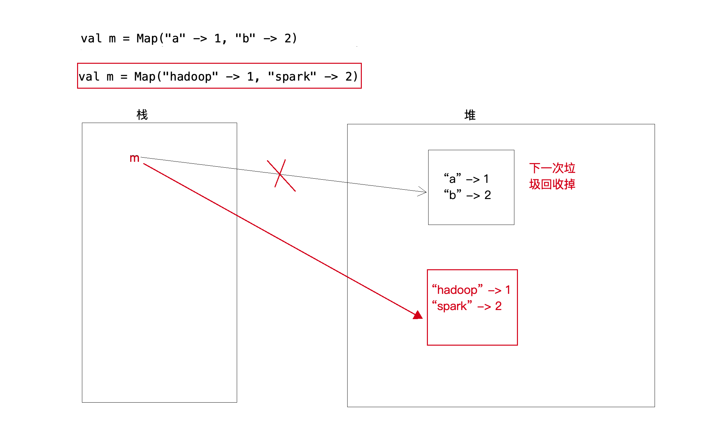
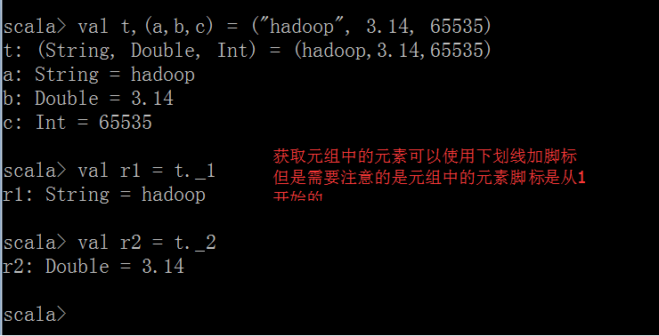

# 1.2 Scala Basics

## ✨ Scala概述

### 什么是Scala

Scala是一种多范式的编程语言，其设计的初衷是要集成面向对象编程和函数式编程的各种特性。Scala运行于Java平台（Java虚拟机），并兼容现有的Java程序。


### 为什么要学Scala

1. 优雅：这是框架设计师第一个要考虑的问题，框架的用户是应用开发程序员，API是否优雅直接影响用户体验。
2. 速度快：Scala语言表达能力强，一行代码抵得上Java多行，开发速度快；Scala是静态编译的，所以和JRuby,Groovy比起来速度会快很多。
3.  能融合到Hadoop生态圈：Hadoop现在是大数据事实标准，Spark并不是要取代Hadoop，而是要完善Hadoop生态。JVM语言大部分可能会想到Java，但Java做出来的API太丑，或者想实现一个优雅的API太费劲。 



## ✨ Scala安装

### 安装JDK

因为Scala是运行在JVM平台上的，所以安装Scala之前要安装JDK

### 安装Scala

#### Windows安装Scala编译器

访问Scala官网http://www.scala-lang.org/下载Scala编译器安装包，目前最新版本是2.12.x，但是目前大多数的框架都是用2.11.x编写开发的，Spark 2.x使用的就是2.11.x，所以这里推荐2.11.x版本，下载Scala-2.11.8.msi后点击下一步

#### Linux安装Scala编译器

下载Scala地址http://downloads.typesafe.com/scala/2.11.8/scala-2.11.8.tgz然后解压Scala到指定目录

`tar -zxvf scala-2.11.8.tgz -C /usr/java`

配置环境变量，将Scala加入到PATH中

`vi /etc/profile`

`export JAVA_HOME=/usr/java/jdk1.8.0_111`

`export PATH=$PATH:$JAVA_HOME/bin:/usr/java/scala-2.11.8/bin`

#### Scala开发工具安装

目前Scala的开发工具主要有两种：Eclipse和IDEA，这两个开发工具都有相应的Scala插件，如果使用Eclipse，直接到Scala官网下载即可http://scala-ide.org/download/sdk.html。

由于IDEA的Scala插件更优秀，大多数Scala程序员都选择IDEA，可以到http://www.jetbrains.com/idea/download/下载社区免费版，点击下一步安装即可，安装时如果有网络可以选择在线安装Scala插件。这里我们使用离线安装Scala插件：

1. 安装IDEA，点击下一步即可。由于我们离线安装插件，所以点击Skip All and Set Default
2. 下载IEDA的Scala插件，地址http://plugins.jetbrains.com/?idea\_ce
3. 安装Scala插件：Configure -&gt; Plugins -&gt; Install plugin from disk -&gt; 选择Scala插件 -&gt; OK -&gt; 重启IDEA


## ✨ Scala基础语法



### 声明变量

_`var`_ `=> variable` 可以改变引用地址

_`val`_ `=> value` 不可以改变引用地址，相当于java里面用final修饰的变量

```scala
object VariableTest {
 def main(args: Array[String]) {
 //使用val定义的变量值是不可变的，相当于java里用final修饰的变量
 val i = 1
 //使用var定义的变量是可变得，在Scala中鼓励使用val
 var s = "hello"
 //Scala编译器会自动推断变量的类型，必要的时候可以指定类型
 //变量名在前，类型在后
 val str: String = "world"
 }
}
```

### 常用类型

Scala和Java一样，有7种数值类型：

Byte、Char、Short、Int、Long、Float和Double（无包装类型）和一个Boolean类型。

### 条件表达式

Scala的的条件表达式比较简洁，例如：

`val r: Any = if (x>0) 100 else "error"`

```scala
object ConditionTest {
 def main(args: Array[String]) {
 val x = 1
 //判断x的值，将结果赋给y
 val y = if (x > 0) 1 else -1
 //打印y的值
 println(y)
 //支持混合类型表达式
 val z = if (x > 1) 1 else "error"
 //打印z的值//类似是Any，相当与是Int和String的父类型
 println(z)
 //如果缺失else，相当于if (x > 2) 1 else ()
 val m = if (x > 2) 1
 println(m)
 //在scala中每个表达式都有值，scala中有个Unit类，写做(),相当于Java中的void
 val n = if (x > 2) 1 else ()
 println(n)
 //if和else if
 val k = if (x < 0) 0
 else if (x >= 1) 1 else -1
 println(k)
 }
}
```

### 块表达式

```scala
object BlockExpressionTest {
 def main(args: Array[String]) {
 
 val x = 0
 //在scala中{}中课包含一系列表达式，块中最后一个表达式的值就是块的值
 //下面就是一个块表达式
 val result = {
 if (x < 0){
 -1
 } else if(x >= 1) {
 1
 } else {
 "error"
 }
 }
 //result的值就是块表达式的结果
 println(result)
 }
}
```

### 循环

在scala中有for循环和while循环，用for循环比较多

for循环语法结构：`for (i <- arr) println(i)`

双层嵌套循环：`for (i <- 1 to 3; j <- 1 to 3; if i != j) println (i * 10 + j)`

```scala
object ForTest {
 def main(args: Array[String]) {
 
 //for(i <- 表达式),表达式1 to 10返回一个Range（区间）
 //每次循环将区间中的一个值赋给i
 for (i <- 1 to 10)
 println(i)
 
 //for(i <- 数组)
 val arr = Array("a", "b", "c")
 for (i <- arr)
 println(i)
 
 //高级for循环
 //每个生成器都可以带一个条件，注意：if前面没有分号
 for(i <- 1 to 3; j <- 1 to 3 if i != j)
 print((10 * i + j) + " ")
 println()
 
 //for推导式：如果for循环的循环体以yield开始，则该循环会构建出一个集合
 //每次迭代生成集合中的一个值
 val v = for (i <- 1 to 10) yield i * 10
 println(v)
 
 }
}
```

#### for循环可以结合yield关键字

把偶数取出来每个乘以100放到新集合里面：`for (i <- 1 to 10 if i % 2 == 0) yield 1 * 100`

### 方法

#### 定义方法

格式：`def m1(x: Int, y: Double): Double = (x + y)`

无参，没有返回值：`def m2(): Unit = {println("hello")}`


方法的返回值类型可以不写，编译器可以自动推断出来，但是对于递归方法，必须指定返回类型。

#### 调用方法

Scala中的`+ - * / %`等操作符的作用与Java一样，位操作符 `& | ^ >> <<`也一样。只是有一点特别的：这些操作符实际上是方法。例如：`a + b`是如下方法调用的简写：`1.+(b)`

`a方法b`可以写成`a.方法(b)`

### 数组 Array

数组一旦定义，长度不能改变，但是数组中的内容可以改变。

`val arr = Array(1,2,3,4,5)`

取值 `arr(0)`返回1；赋值 `arr(0) += 100`

#### 可变数组 ArrayBuffer <a id="scala-de-ke-bian-shu-zu-arraybuffer"></a>

`val ab = new ArrayBuffer[Int](8)` //初始8个长度的数组

追加元素 `+=`；移除元素 `-=`；追加多个元素 `++=`

```scala
import scala.collection.mutable.ArrayBuffer

object ArrayTest {

 def main(args: Array[String]) {
 
 //初始化一个长度为8的定长数组，其所有元素均为0
 val arr1 = new Array[Int](8)
 //直接打印定长数组，内容为数组的hashcode值
 println(arr1)
 //将数组转换成数组缓冲，就可以看到原数组中的内容了
 //toBuffer会将数组转换长数组缓冲
 println(arr1.toBuffer)
 
 //注意：如果new，相当于调用了数组的apply方法，直接为数组赋值
 //初始化一个长度为1的定长数组
 val arr2 = Array[Int](10)
 println(arr2.toBuffer)
 
 //定义一个长度为3的定长数组
 val arr3 = Array("hadoop", "storm", "spark")
 //使用()来访问元素
 println(arr3(2))


 //变长数组（数组缓冲）
 //如果想使用数组缓冲，需要导入import scala.collection.mutable.ArrayBuffer包
 val ab = ArrayBuffer[Int]()
 //向数组缓冲的尾部追加一个元素
 //+=尾部追加元素
 ab += 1
 //追加多个元素
 ab += (2, 3, 4, 5)
 //追加一个数组++=
 ab ++= Array(6, 7)
 //追加一个数组缓冲
 ab ++= ArrayBuffer(8,9)
 //打印数组缓冲ab
 
 //在数组某个位置插入元素用insertab.insert(0, -1, 0)
 //删除数组某个位置的元素用remove
 ab.remove(8, 2)
 println(ab)
 }
}
```

#### 遍历数组

* 增强for循环
* 好用的until会生成脚标，0 until 10 包含0不包含10


```scala
object ForArrayTest {
 def main(args: Array[String]) {
 //初始化一个数组
 val arr = Array(1,2,3,4,5,6,7,8)
 //增强for循环
 for(i <- arr)
 println(i)
 
 //好用的until会生成一个Range
 //reverse是将前面生成的Range反转
 for(i <- (0 until arr.length).reverse)
 println(arr(i))
 
 }
}
```

#### 数组常用算法

在Scala中，数组上的某些方法对数组进行相应的操作非常方便！


### 集合

Scala的集合有三大类：**序列**_**List**_**、集**_**Set**_**、映射**_**Map**_，所有的集合都扩展自Iterable特质。

在Scala中集合有可变（_mutable_）和不可变（_immutable_）两种类型，immutable类型的集合初始化后就不能改变了（注意与val修饰的变量进行区别）。

 创建可变Set：`val s1 = new HashSet[Int]`，`s1.contains(8)`返回True/False ，等价于 `s1(8)`

`s1 += 7`；`s1 -= 8`；`s1 ++= Set(9,10,10)`

#### 序列 List

不可变的序列 `import scala.collection.immutable._`

不可变的序列，只能遍历list里面的值：`val lst = List(1,2,3,4,5)`

原来的List不会变化，只会生成一个新的list：`lst :+ 6`; `0 +: lst`

在Scala中列表要么为空（_Nil_表示空列表）要么是一个head元素加上一个tail列表。

`9 :: List(5, 2) ::` 操作符是将给定的头和尾创建一个新的列表。

**注意**：_`::` 操作符是右结合的，如`9 :: 5 :: 2 :: Nil`相当于 `9 :: (5 :: (2 :: Nil))`_

```scala
object ImmutListTest {

 def main(args: Array[String]) {
 //创建一个不可变的集合
 val lst1 = List(1,2,3)
 
 //将0插入到lst1的前面生成一个新的List
 val lst2 = 0 :: lst1
 val lst3 = lst1.::(0)
 val lst4 = 0 +: lst1
 val lst5 = lst1.+:(0)
 
 //将一个元素添加到lst1的后面产生一个新的集合
 val lst6 = lst1 :+ 3
 val lst0 = List(4,5,6)
 
 //将2个list合并成一个新的List
 val lst7 = lst1 ++ lst0
 
 //将lst0插入到lst1前面生成一个新的集合
 val lst8 = lst1 ++: lst0
 
 //将lst0插入到lst1前面生成一个新的集合
 val lst9 = lst1.:::(lst0)
 println(lst9)
 }
}
```


可变的序列`import scala.collection.mutable._`

```scala
import scala.collection.mutable.ListBuffer

object MutListTest extends App{
 //构建一个可变列表，初始有3个元素1,2,3
 val lst0 = ListBuffer[Int](1,2,3)
 //创建一个空的可变列表
 val lst1 = new ListBuffer[Int]
 
 //向lst1中追加元素，注意：没有生成新的集合
 lst1 += 4
 lst1.append(5)
 
 //将lst1中的元素最近到lst0中， 注意：没有生成新的集合
 lst0 ++= lst1
 
 //将lst0和lst1合并成一个新的ListBuffer 注意：生成了一个集合val 
 lst2= lst0 ++ lst1
 
 //将元素追加到lst0的后面生成一个新的集合
  val lst3 = lst0 :+ 5
}
```

#### 映射 Map

在Scala中，把哈希表这种数据结构叫做映射。

`val m = new HashMap[String, Int]`定义一个可变的map。

追加元素：`m.put("a", 1)`; `m("b") = 2`; `m += ("c" -> 3)`; `m += (("d", 4))`

移除元素：`m.remove("c")`; `m -= c`

**构建映射：**


**获取和修改映射中的值：**


好用的`getOrElse`


**注意**：_在Scala中，有两种Map，一个是immutable包下的Map，该Map中的内容不可变；另一个是mutable包下的Map，该Map中的内容可变！_


**注意**：_通常我们在创建一个集合是会用val这个关键字修饰一个变量（相当于java中的final），那么就意味着该变量的引用不可变，该引用中的内容是不是可变，取决于这个引用指向的集合的类型。_

```scala
import scala.collection.mutable

//可变的Map
object MutMapTest extends App{
 val map1 = new mutable.HashMap[String, Int]()
 //向map中添加数据
 map1("spark") = 1
 map1 += (("hadoop", 2))
 map1.put("storm", 3)
 println(map1)
 //从map中移除元素
 map1 -= "spark"
 map1.remove("hadoop")
 println(map1)
}
```



#### 集合 Set

不可变的Set

```scala
import scala.collection.immutable.HashSet

object ImmutSetTest extends App{
 val set1 = new HashSet[Int]()
 //将元素和set1合并生成一个新的set，原有set不变
 val set2 = set1 + 4
 //set中元素不能重复
 val set3 = set1 ++ Set(5, 6, 7)
 val set0 = Set(1,3,4) ++ set1
 println(set0.getClass)
}
```

可变的Set

```scala
import scala.collection.mutable

object MutSetTest extends App{
 //创建一个可变的HashSet
 val set1 = new mutable.HashSet[Int]()
 //向HashSet中添加元素
 set1 += 2
 //add等价于+=
 set1.add(4)
 set1 ++= Set(1,3,5)
 println(set1)
 //删除一个元素
 set1 -= 5
 set1.remove(2)
 println(set1)
}
```

### 

### 元组 Tuple

映射是K/V对偶的集合，对偶是元组的最简单形式，元组可以装着多个不同类型的值。元组是Scala中特殊的集合，可以装各种类型。长度和内容都不可变的数组，不可被赋值，只用来装数据。

**创建元组：**


**获取元组中的值：**



**将对偶的集合转换成映射：**


**拉链操作：**

`zip`命令可以将多个值绑定在一起。


**注意**：_如果两个数组的元素个数不一致，拉链操作后生成的数组的长度为较小的那个数组的元素个数_


