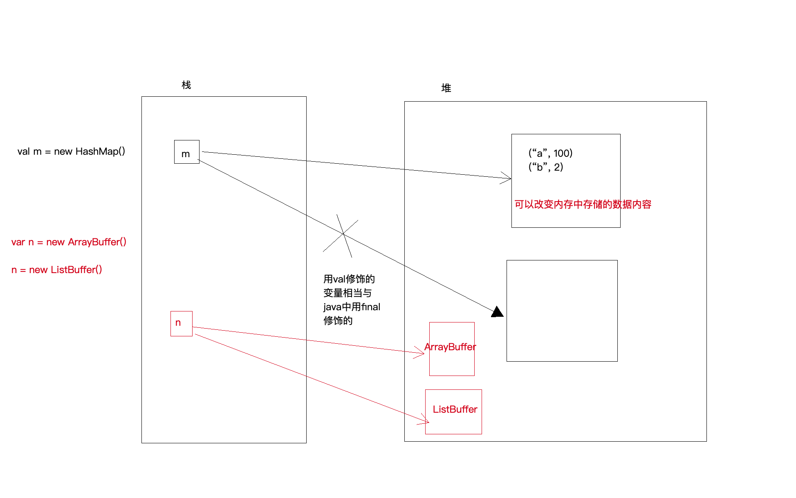

# 2.2 Scala course notes

## Day 01

## 学习内容

#### Scala变量的定义

_`var`_ `=> variable 可以改变引用地址；`

_`val`_ `=> value 不可以改变引用地址，相当于java里面用final修饰的变量`

#### Scala数据类型

8种，没有包装类，基本类型首字母都大写

#### Scala的if判断

`val r: Any = if (x>0) 100 else "error"`

#### Scala的for循环

`for  (i <- arr) println(i)`

双层嵌套循环：`for (i <- 1 to 3; j <- 1 to 3; if i != j) println (i * 10 + j)`

#### for循环结合yield关键字

把偶数取出来每个乘以100放到新集合里面：`for (i <- 1 to 10 if i % 2 == 0) yield 1 * 100`

#### scala方法的定义

`def m1(x: Int, y: Double): Double = (x + y)`

无参，没有返回值：`def m2(): Unit = {println("hello")}`

#### Scala方法的调用

a 方法 b 等价于 a.方法\(b\)，`1 + 10` 等价于 `1.+(10)`

#### scala的数组

数组一旦定义，长度不能改变，但是数组中的内容可以改变。

`val arr = Array(1,2,3,4,5)`

取值 `arr(0)` //返回1；赋值 `arr(0) += 100`

#### Scala的可变数组ArrayBuffer

`val ab = new ArrayBuffer[Int](8)` //初始8个长度的数组

追加元素 `+=`；移除元素 `-=`；追加多个元素 `++=`

#### 不可变set和可变set

`val s1 = new HashSet[Int]` //导入可变Set

s1.contains\(8\) 返回True/False 等价于 s1\(8\)

`s1 += 7`；`s1 -= 8`；`s1 ++= Set(9,10,10)`

#### 不可变map和可变map

`val m = new HashMap[String, Int]`//定义一个可变的map

追加元素：`m.put("a", 1)`; `m("b") = 2`; `m += ("c" -> 3)`; `m += (("d", 4))`

移除元素：`m.remove("c")`; `m -= c`

#### 不可变List和可变ListBuffer

不可变，只能遍历list里面的值：`val lst = List(1,2,3,4,5)`

原来的不会变化，只会生成一个新的list：`lst :+ 6`; `0 +: lst`

### 重要总结

数组一旦定义，长度不能改变，但是数组中的内容可以改变。

Scala的不可变集合，长度和内容都不可以改变 。

Scala的可变集合，长度和内容都可以改变。可变集合在原来基础追加一个元素+=，移除一个元素-=，追加多元素++=

**val m = Map\("a" -&gt; 1, "b" -&gt; 2\)**

